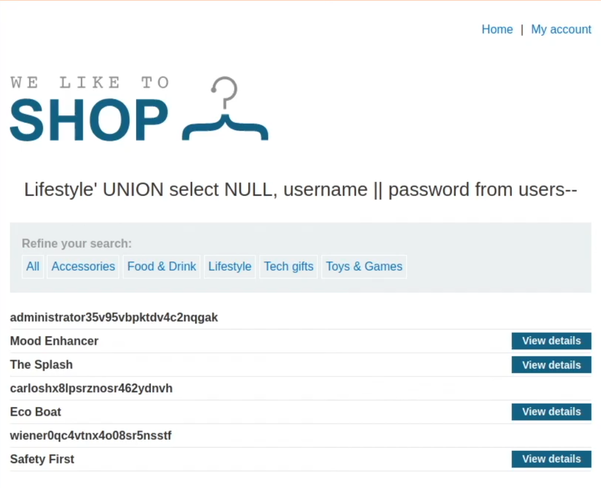

# Retrieving multiple values in a single column

**Vulnerability:** SQL injection in Category filter

---

### Objective
The goal of this lab is to make use of the SQL injection vulnerability present in the Product Category filter of the website, and use this to inject a query to retrieve all the usernames and passwords into a single column and then login as the admin.

---

### Methodology

#### 1. Reconnaissance
My initial step was to analyze the login functionality. I observed that the application uses a standard username and password form that submits a POST request to the server. It was filtering out the query as text so there was no SQL command vulnerability here to exploit. 
Nothing too specific or useful here, I knew that I had to use the filter vulnerability to enter the details here.

#### 2. Discovery & Exploitation
I started with a basic SQL injection payload, into the product category filter, by proxying the response into BurpSuite and sending it to the repeater.

*   **Step 1:** In the field I first determined the number of columns `' ORDER BY 2--` or `' UNION SELECT NULL, NULL--`.  Since this was not an Oracle DB (it was Postgre), these queries worked. The second query was modified to `' UNION SELECT NULL, 'wasd'--`, as column 2 only accepted strings.
*   **Step 2:** Once it was clear that there were 2 columns, I used a query similar to this  `' UNION SELECT NULL, username ||'~'|| password FROM users`  The lab specfied
the names of the columns and the table, so there was no need to dig into the database looking for tables, or dig into the schema of the said table.
*   **Step 3:** Once I get an OK response (200), I checked the page's HTML for the usernames and passwords concatenated as a single column. Then I used the unencrypted admin login and password on the website.

#### 3. Result
The application successfully logged me in as the `administrator` user, which was the main task. This confirmed the presence of a critical SQL injection vulnerability.

---

### Key Takeaways
*   This demonstrates a simple logical flaw in query construction which can lead to a full account takeover.
*   It is necessary to sanitize and validate user input on the server side, to make sure no input is parsed as a query/command.
*   The developer must use parameterized queries through prepared statements to prevent SQL injection vulnerabilities. This is the single most efficient way to prevent almost every simple thoughtless SQL injection attempt

